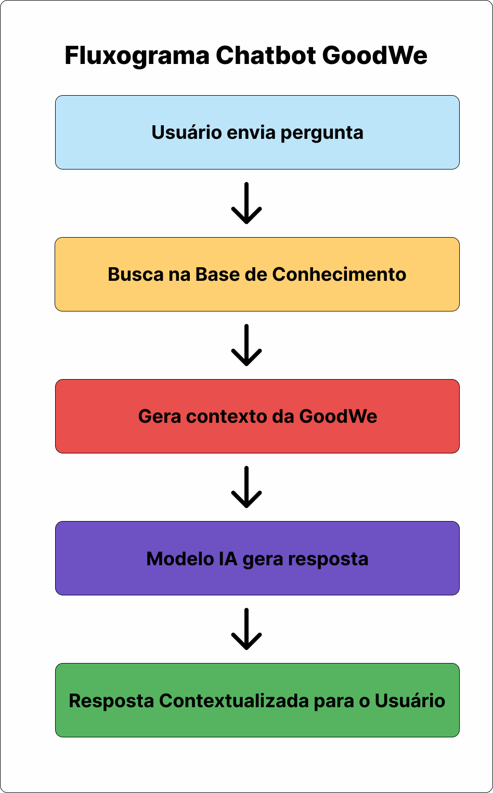

# Chatbot GoodWe — Sprint 1

## Integrantes

- Arthur Costa — RM569976
- Guilherme Detta — RM569666
- Henrique Bolfer — RM569514
- Igor Alves — RM574127

---

## Problema

Os sistemas de eletropostos apresentam ausência de mecanismos integrados para:

- Orquestrar potência e ciclos de carregamento.
- Registrar sessões e faturamento.
- Comunicar-se com usuários.
- Gerenciar uso compartilhado em condomínios.

---

## Proposta de Solução

Desenvolver um chatbot operacional voltado ao **operador comercial do ChargeGrid**, que:

- Traduza dados de sessão e demanda em insights práticos.
- Responda dúvidas sobre potência, faturamento e ciclos de carregamento.
- Sugira ações para períodos de pico e para melhor aproveitamento da infraestrutura.
- Apoie comunicações com usuários e a equipe de manutenção.

Este escopo é justificado porque um operador comercial precisa de informações rápidas e contextualizadas para tomar decisões sobre tarifas, carga e atendimento, o que encaixa com a proposta do EV Challenge 2026.

---

## Tecnologias Selecionadas e Justificativa Técnica

- **Python**: linguagem principal para o protótipo, com boas bibliotecas de IA e facilidade de integração.
- **LangChain + LangGraph**: para estruturar o fluxo de recuperação de contexto e geração de respostas em etapas claras.
- **OpenAI Embeddings**: para vetorização semântica dos documentos e busca de contexto relevante.
- **OpenAI API**: para geração de linguagem natural e resposta contextualizada baseada no prompt.

---

## System Prompt

"""
Você é o Chatbot GoodWe, um assistente operacional para o ChargeGrid Intelligence.
Sua persona é o operador comercial de eletropostos.
Seu papel é responder perguntas sobre:

- Potência utilizada
- Ciclos de carregamento
- Faturamento
- Comunicação com usuários
- Gestão de horários de pico

Responda sempre de forma clara, objetiva e contextualizada ao EV Challenge 2026.
"""

---

## Fluxograma de Funcionamento

Etapas principais:

1. Usuário envia pergunta.
2. Sistema busca contexto na base de conhecimento.
3. Prompt é montado com contexto e pergunta.
4. Modelo processa e gera resposta contextualizada.
5. Resposta é entregue ao usuário.



---

## Modelo de Teste

| Pergunta                                             | Resposta Esperada                                                                   |
| ---------------------------------------------------- | ----------------------------------------------------------------------------------- |
| Qual foi meu pico de potência ontem?                 | Ontem, o pico de potência foi de 47 kW às 18h.                                      |
| Quanto devo cobrar às 18h?                           | Às 18h, considerando alta demanda, o valor sugerido é R$ 2,10/kWh.                  |
| Quantos ciclos de carregamento ocorreram hoje?       | Hoje foram registrados 23 ciclos de carregamento.                                   |
| Qual foi o faturamento da semana passada?            | Na semana passada, o faturamento total foi de R$ 12.340,00.                         |
| Como comunicar aos usuários sobre manutenção amanhã? | Enviar notificação via aplicativo e e-mail informando manutenção programada às 10h. |

---

## Como Executar

1. Clone o repositório:
   ```bash
   git clone https://github.com/IgorLDev/chargegrid-chatbot
   ```
2. Instale dependências:
   ```bash
   python -m pip install -r requirements.txt
   ```
3. Configure a variável de ambiente `OPENAI_API_KEY`.
4. Execute:
   ```bash
   python chatbot_goodwe.py
   ```

---

## Observações

- Este projeto considera o contexto comercial do ChargeGrid Intelligence, pois a persona escolhida é o operador comercial.
- O foco da Sprint 1 é documentar a proposta técnica, definir o escopo e preparar o modelo de teste para a Sprint 2.
